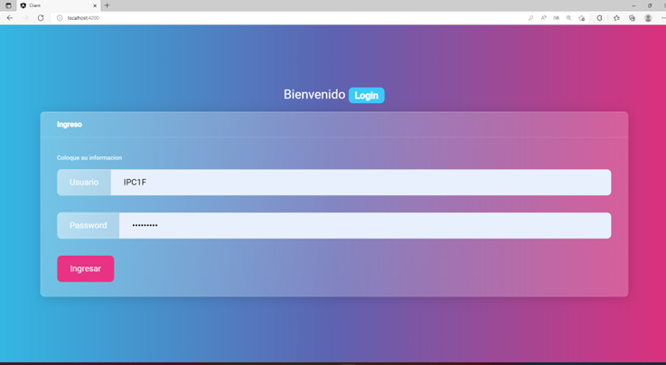
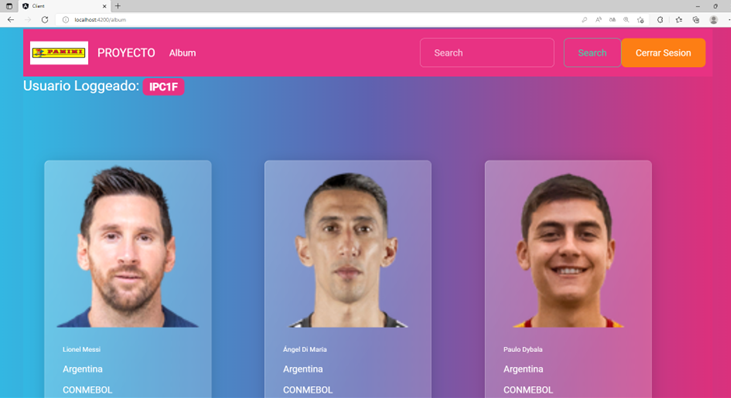

|  Nombre  |  Apellido  |  Carnet  |
| ---------------- | ------------------ | -------------|
|  Carlos Alfredo  |  Barrientos López  |  202003948  |
| Javier Oswaldo | Mirón Cifuentes | ------------ |

# *Frontend*
## Angular
#### Se trata de un FrameWork de JavaScript que se utiliza para crear aplicaciones de una sola página.
#### Dado que su uso de arquitectura Modelo-Vista-Controladores va escribiendo manualmente el código de TypeScript para los archivos HTML y JavaScript.

## Bootstrap
#### Se trata de un FrameWork de desarrollo Web, siendo gratuito y código abierto. Dónde está enfocado en facilitar el diseño del porceso de desarrollo de los sitios Web. Proporcionando así una basta sintaxis de plantillas y componentes para hacer más dinámica entre la experiencia del usuario con la Página Web.

## Node js
#### Es un entorno en tiempo de ejecución multiplataforma para el lado del servidor  basado en JavaScript. Por eventos diseñados para crear aplicaciones escalables, permitiéndote establecer y gestionar múltiples conexiones al mismo tiempo.

##### Teniendo así 3 herramientas las cuáles nos permitieron hacer la conexión entre el lado del servidor como el lado del cliente, siendo está un gran pilar de innovación en las nuevas tecnologías digitales emergentes.

* Express
* Morgan
* Cors

## Manual de Usuario 
#### Se realizó una Página Web, en el entorno de Angular. La cuál es una página de un Album de PANINI del mundial de Qatar 2,022. Dónde se brinda una descripción de los jugadores de los equipos participantes.

#### Dónde cuenta con Login para los usuarios en el cuál deberán colocar sus credenciales para poder acceder a la página del Album en el cuál podrán buscar a sus jugadores favoritos.

#### Ya en la página de Album podrá encontrar una descripción general de los jugadores de los equipos participantes en el mundial de Qatar 2,022 y también cuenta con un buscador en el cuál funciona para filtrar la información de los jugadores por 3  filtros brindados los cuáles son: 

1. Nombre
2. Selección
3. Región 

# *Backend*
## Módulos
### Express
#### Es un infraestructura de aplicaciones Web de Node.js, mínima y flexible que proporciona un conjunto sólido de características para las aplicaciones. Con miles de métodos de programa de utilidad HTTP y Middleware a su disposición para la creación de una API sólida es rápida y sencilla.

### Morgan
#### Es un Middleware de nivel de solicitud HTTP. Es una gran herramienta que registra las requests junto con alguna otra información dependiendo de su configuración y el valor predeterminado utilizado. Demuestra ser muy útil durante la depuración y también si desea crear archivos de registro.

### Cors
#### Nos referimos a un mecanismo de seguridad que aplican los navegadores cuando estamos haciendo una petición a un recurso que está alojado en otro origen. Si el recurso está en otro origen, el navegador automáticamente comprobará las cabeceras HTTP buscando una autorización expresa por parte del servidor.

## Requerimientos
#### Se necesitaba que se creara una API con datos de jugadores con sus selecciones y regiones, los cuáles se fueron metiendo en constantes en formato JSON para así poder ir creando las rutas que usariamos para buscar la información de cada uno en nuestro Puerto. Dónde se solicitaba los siguientes datos de cada jugador para dar una mejor descripción de cada uno:

* id
* Nombre
* Apellido
* Selección
* Región 
* Imagen:

#### Para poder acceder al Album se necesitaba un administrador el cuál tenia los siguientes atributos:

* Usuario
* Contraseña

#### Luego de loggearse con éxito, podrá ir buscando la información de los jugadores deseados, sin importar por cuál atributo conociera el administrador se debia mostrar en el Página Web la información solicitada, así se creó una página la cuál fuera sencilla y amigable con el usuario para que entendiera rápidamente el uso de la misma y no tuviera que perder tanto tiempo en el manejo de la misma.

## Puerto
#### Estamos usando uns extensión de Cors para asegurarnos de que nuestro API se encuentre segura en un sólo puerto y no entre más información en nuestro servidor el cuál está alojado en el Puerto 3,000 de nuestro LocalHost en nuestra computadora y así poder acceder a nuestros datos desde nuestro navegador.

## EndPoint's
### Usuarios
#### Se taggea la información de cada usuario ingresado en nuesro BackEnd así poder ver nuestras credenciales por si se nos llegan a olvidar 

### Jugadores
#### Se muestra la descripción completa de todos los jugadores cargados en el BackEnd para poder ir haciendo las solicitudes en nuestro FrontEnd para saber como buscarlos y ver cuantos jugadores fueron al mundial de Qatar 2,022

### Nombre
#### Es un filtro dónde se puede buscar a los jugadores más conocidos por su nombre por si no sabemos de cuál País son así mismo de cuál es la Región pertenecen y es un filtro difícil pues los nombres de los jugadores no son tan conocidos.

### Selección
#### Es un filtro dónde se puede buscar a los jugadores por su País de origen, pues durante todo los mundiales sabemos en cuál selección juega más no de dónde provienen de sus clubes o regiones, es una busqueda más sencilla para encontrar a nuestros jugadores favoritos.

### Región
#### Es un filtro dónde se puede buscar a los equipos por la Federación en la cuál están asociados los equipos para realizar el una competencia equitativa y poder crecer el fútbol internacional.